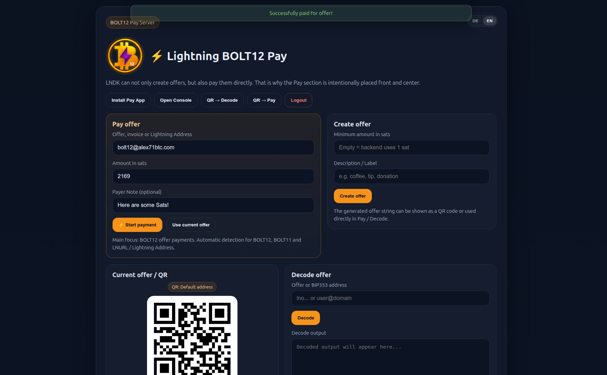
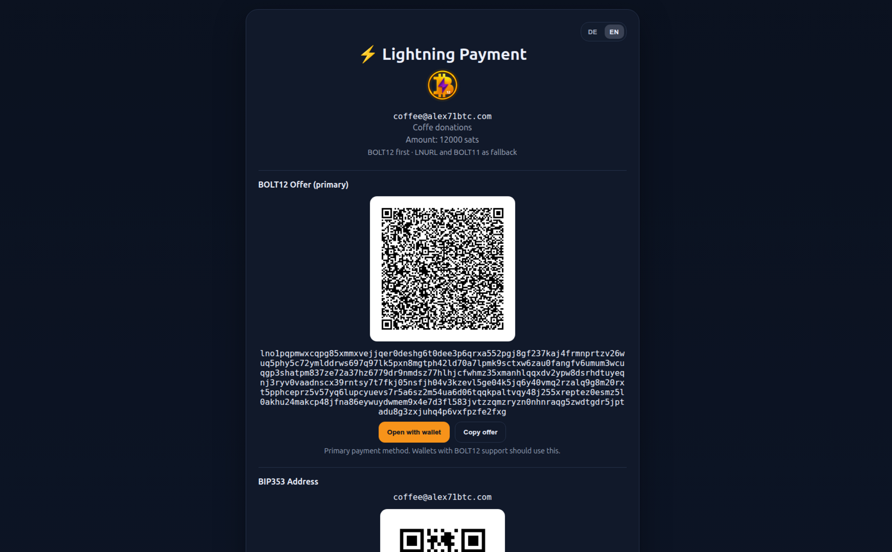
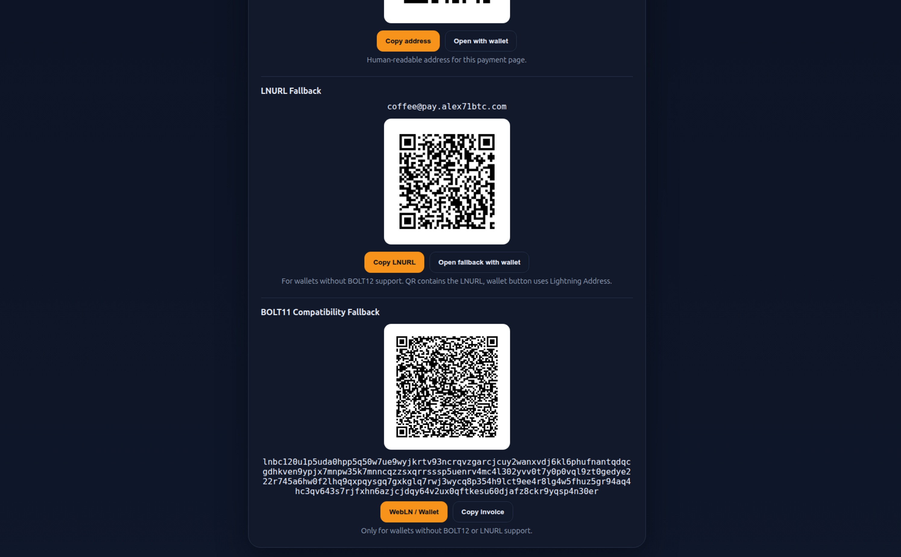
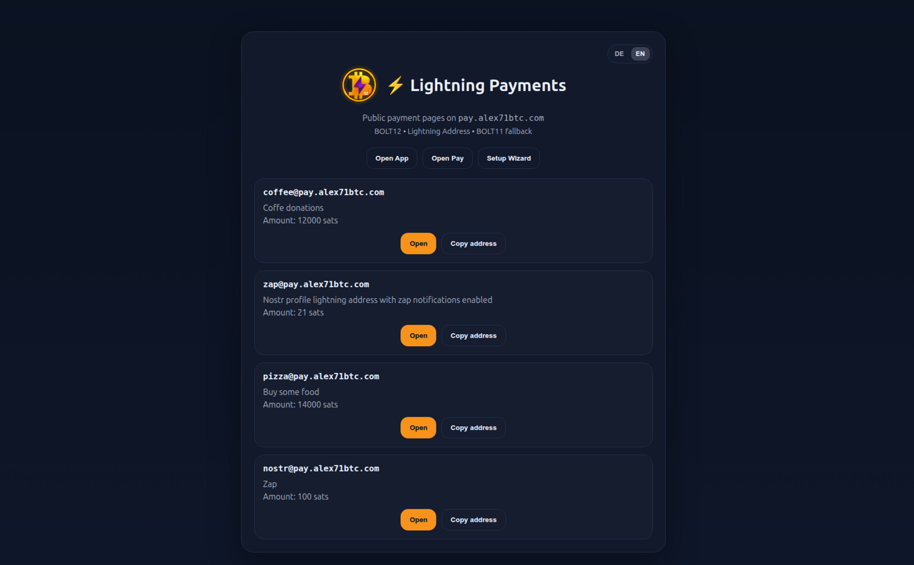

# ⚡ BOLT12 Pay

Self-hosted Lightning payment and identity server with next-generation BOLT12 support.

## ✨ Features

* ⚡ BOLT12 Offers (receive payments)
* 🔗 Lightning Address (BIP353)
* 🔄 LNURL support (fallback)
* 🧾 BOLT11 fallback invoices
* 🧠 Nostr identity (NIP-05 + Zaps)
* 📱 QR-based payments
* ☁️ Optional Cloudflare DNS automation

---

## ⚠️ Important: LND Configuration (Required)

BOLT12 requires **onion messaging** in LND.

### Edit lnd.conf on Umbrel

Connect to your Umbrel via SSH:

```bash
ssh umbrel@umbrel.local

#Then open the LND config file:

```bash

nano ~/umbrel/app-data/lightning/data/lnd/lnd.conf
### 2. Add the following lines at the end of the file:

```
[protocol]
custom-message=513
custom-nodeann=39
custom-init=39
```

### 3. Restart Lightning

---

## 🚀 Quick Start (Umbrel)

1. Install **BOLT12 Pay** from the Community App Store
2. Open the app
3. Complete setup:

   * Public BOLT12 Address (e.g. [bolt12@yourdomain.com](mailto:bolt12@yourdomain.com))
   * Lightning Address (e.g. [lnurl@yourdomain.com](mailto:lnurl@yourdomain.com))
   * Domain / DNS settings
4. Done 🎉

---

## 🌐 Example

* BOLT12: [bolt12@yourdomain.com](mailto:bolt12@yourdomain.com)
* LNURL: [lnurl@yourdomain.com](mailto:lnurl@yourdomain.com)

---

## 🔒 Self-hosted

* No custodians
* Runs on your node
* Full control

---

## 📜 License

MIT

## Features

- Native BOLT12 Offers
  - Create offers via LNDK
  - Pay BOLT12 offers directly
- Lightning Address
  - BIP353-compatible addresses
  - Self-hosted LNURL server
- BOLT11 fallback
  - Better compatibility with today’s wallets
- Nostr identity
  - NIP-05 support
  - Zap support
  - DM notifications
  - Multi-relay support
- Cloudflare DNS integration
  - Optional automatic DNS publishing
- Umbrel ready
  - Packaged as an Umbrel Community App
- Clean UX
  - Mobile-friendly payment pages
  - QR-based flows
  - Bilingual UI support (EN/DE)

## Architecture

BOLT12 Pay combines multiple layers:

- **BOLT12 / LNDK** for modern offer-based Lightning payments
- **LNURL / Lightning Address** for broad wallet compatibility
- **BIP353** for human-readable payment addresses
- **Nostr** for identity and Zap-related functionality
- **Umbrel deployment** for easy self-hosting

This makes BOLT12 Pay a bridge between current Lightning infrastructure and the next generation of Lightning payments.

## Main Capabilities

### Payment pages
Public alias pages can expose:

- BOLT12 Offer
- BIP353 address
- LNURL fallback
- BOLT11 fallback

### Admin / Pay UI
The built-in interface allows you to:

- create BOLT12 offers
- pay BOLT12 offers
- decode offers and BIP353 targets
- manage aliases
- generate Lightning-compatible QR flows
- configure identity and Nostr integration

### Identity
BOLT12 Pay can also act as a payment identity hub:

- NIP-05 identity mapping
- Zap-enabled addresses
- optional notification flows

## Example Use Cases

- Self-hosted Lightning Address for your own domain
- Public donation / tip page
- Personal or business payment identity
- Nostr Zap receiving endpoint
- Experimental BOLT12 infrastructure on Umbrel
- Sovereign replacement for custodial Lightning identity services

## Status

BOLT12 Pay is functional and already usable, but parts of the stack are still cutting-edge.

### Experimental areas

- BOLT12 support on LND is still evolving
- wallet support for BOLT12 remains inconsistent across the ecosystem
- some flows still rely on fallback layers for broad compatibility

BOLT12 Pay has two different types of traffic:

**1. Admin / control interface (sensitive)**
- `/pay`
- `/pay-login`
- setup and admin actions
- identity management, payments, etc.

**2. Public payment endpoints (must stay reachable)**
- Lightning Address (LNURL)
- public payment pages
- BIP353 resolution
- payment callbacks

Because of this, a single global protection rule is **not sufficient**.

---

## Recommended setup (Cloudflare Access)

Use **two separate Cloudflare Access applications** for the same hostname.

### 1. Admin App → `ALLOW`

Protect all admin-related routes.

**Paths to protect:**

- `/pay*`
- `/pay-login*`

**Policy:**

- Action: `ALLOW`
- Require login (Google, GitHub, email, etc.)
- Short session duration recommended

This ensures that the admin UI is never publicly accessible.

---

### 2. Public App → `BYPASS`

Allow public access for payment-related traffic.

**Policy:**

- Action: `BYPASS`

This is required so that:

- Lightning Address works
- LNURL requests succeed
- wallets can access payment endpoints
- public payment pages remain usable

---

## Example logic

A typical path-based setup looks like:

**Protected:**
- `/pay*`
- `/pay-login*`

**Public:**
- `/`
- `/app` (if needed for public flows)
- `/.well-known/*`
- `/api/lnurl/*`
- `/api/lnurl/callback`
- other public payment endpoints

Adjust paths depending on your configuration.

---

## ⚠️ Important

Do NOT:

- protect the entire app with a single `ALLOW` rule  
  → breaks public payment flows

- leave `/pay` publicly accessible without protection  
  → exposes full admin interface

---

## Recommended additional hardening

- set an admin password in BOLT12 Pay
- use Cloudflare Access session limits
- restrict exposure to only necessary endpoints
- avoid exposing raw backend APIs directly

---

## TL;DR

- **Admin UI → protected**
- **Payment endpoints → public**

This separation is required for a functional self-hosted Lightning service.

## Screenshots










## Roadmap

- NWC integration
- expanded Nostr Zap flows
- better notification and event publishing support
- optional Phoenixd backend support
- improved wallet interoperability
- additional self-hosted identity features

## Funding

This project is a strong candidate for open-source Bitcoin / Lightning grants.

If you would like to support development, feel free to open an issue or reach out.


## Important directories

- `app/` application source
- `deploy/` deployment compose files
- `umbrel/bolt12-pay/` future Umbrel Community App files
- `docs/` project docs

## Deployment files

- `deploy/docker-compose.local.yml`
- `deploy/docker-compose.umbrel.yml`

## Architecture

See:

- `docs/architecture.md`
