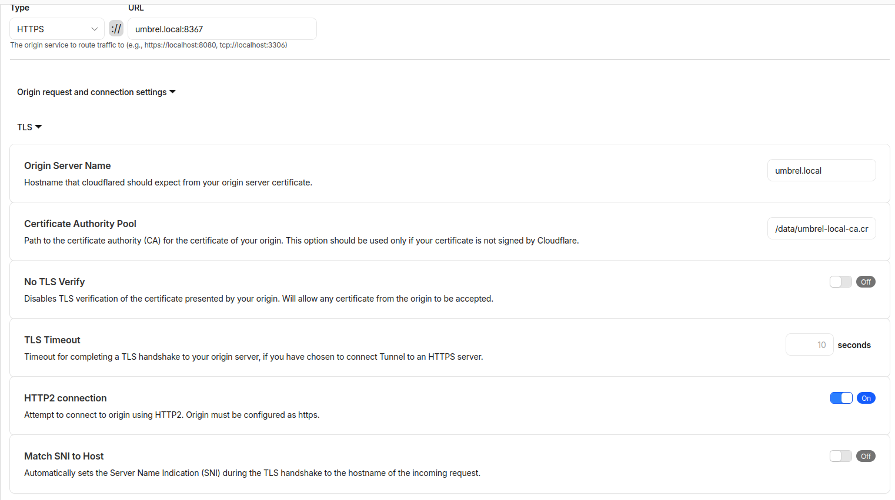

# ⚡ BOLT12 Pay

[](https://apps.umbrel.com/app/bolt12-pay)

[](https://marketplace.start9.com/?registry=https:%2F%2Fcommunity-registry.start9.com%2F&id=bolt12-pay)

Self-hosted Lightning payment and identity server with next-generation BOLT12 support.

---

## ✨ Features

- ⚡ BOLT12 Offers (create & pay)
- 🔗 Lightning Address (BIP353)
- 🔄 LNURL fallback
- 🧾 Optional BOLT11 fallback invoices, created only on request
- 🧠 Nostr identity (NIP-05 + Zaps)
- 📱 QR-based payments
- ☁️ Optional Cloudflare DNS automation
- 🌐 Automatic Cloudflare DNS provisioning for BIP353 and LNURL
- 🟢 Available in the official Start9 Community Registry

---

## ⚠️ Requirement: LND Lightning node

BOLT12 Pay requires a LND Lightning node with at least one active channel, better a well connected node with multiple channels opened.

---
# 🌍 Before You Start

BOLT12 Pay works best when you already own a domain name.

Recommended:

- a personal domain (for example `yourdomain.com`)
- DNS hosted at Cloudflare
- Cloudflare API Token (optional, for automatic DNS management)

Without a domain you can still:

- create, pay and receive BOLT12 Offers (without Bip 353)
- test BOLT12 functionality locally

Public Alias pages use the Lightning Address/LNURL path without creating a BOLT11 invoice in the background. A visitor can explicitly click **Generate BOLT11 fallback invoice** if an older wallet still needs one. For an alias with a variable amount, the visitor enters the amount first; an alias with a fixed amount uses its configured value. Reloading the page never creates another invoice.

However:

- BIP353 Lightning Addresses require a domain
- LNURL Addresses require a domain
- Public payment pages require a public domain

## Official app availability

BOLT12 Pay is officially available on:

- Umbrel App Store
- StartOS Community Registry / Marketplace

---

# 🟣 Umbrel Setup

## Quick start

1. Make sure the Lightning Node app is synced and has at least one active channel.
2. Install **BOLT12 Pay** from the Umbrel App Store.
3. Open `https://umbrel.local:8367`. On first launch, BOLT12 Pay opens the setup screen automatically.

LND v0.21 and newer already include Onion Messaging. No manual LND configuration is required.

When Cloudflare automation asks for the **Zone Domain**, enter the root domain, for example `yourdomain.com` — not `pay.yourdomain.com`.

## Trust UmbrelOS 2.0 HTTPS

UmbrelOS 2.0 uses a private **Umbrel Local HTTPS CA** for local addresses. Export that CA from Umbrel and install the CA certificate on every computer that should open BOLT12 Pay. Install the CA certificate, never a private key.

On Debian or Ubuntu, assuming the downloaded certificate is named `umbrel-local-ca.crt`:

```bash
sudo install -m 0644 ~/Downloads/umbrel-local-ca.crt /usr/local/share/ca-certificates/umbrel-local-ca.crt
sudo update-ca-certificates
```

Completely restart the browser afterwards. The local addresses are:

```text
Umbrel:       https://umbrel.local
BOLT12 Pay:   https://umbrel.local:8367
Admin:        https://umbrel.local:8367/pay
```

A redirect from `/pay` to an Umbrel login page is normal and does not indicate a certificate error.

- Firefox: if the CA is still not trusted, import it in Firefox certificate settings or enable `security.enterprise_roots.enabled` in `about:config`.
- Chromium: inspect certificate handling at `chrome://settings/certificates`.
- Camera access is stored separately for `https://umbrel.local` and `https://umbrel.local:8367`. Allow it for the address including port `8367`.

`about:...` and `chrome://...` belong in the browser address bar, not in a terminal. If the camera works in a private window but not in the normal profile, reset the camera permission and stored site data for `https://umbrel.local:8367`.

## Cloudflare Tunnel on UmbrelOS 2.0

Use Umbrel's HTTPS origin and keep certificate verification enabled:

| Cloudflare setting | Value |
| --- | --- |
| Service | `https://umbrel.local:8367` |
| Origin Server Name | `umbrel.local` |
| Certificate Authority Pool | `/etc/cloudflared/umbrel-local-ca.crt` |
| HTTP2 connection | On |
| No TLS Verify | **Off** |
| Match SNI to Host | Off |



In BOLT12 Pay, enter your public Tunnel address — for example `https://pay.yourdomain.com` — as the **LNURL Base URL**. Wallets need this public address to find your Lightning Address and complete payments.

Cloudflare Access is optional. If you use it, protect only the private admin area. Do not put a Cloudflare login in front of the entire public domain, because wallets cannot click through a login page and payments would fail.

<details>
<summary>Legacy LND v0.20.1 beta</summary>

Only LND ≤ v0.20.1 needs these entries in `Apps → lightning → data → lnd → lnd.conf`:

```text
[protocol]
protocol.custom-message=513
protocol.custom-nodeann=39
protocol.custom-init=39
```

Restart the Lightning Node app after saving. **Remove this entire block before upgrading to LND v0.21 or newer**, then restart LND and perform the update.

</details>

---


# 🟢 StartOS Setup (Recommended)


BOLT12 Pay is available in the official Start9 Community Registry ⚡

Features:

- one-click installation
- StartOS 0.4 support
- integrated LNDK runtime
- BOLT12 Offers
- Lightning Address support
- LNURL fallback

## Install from Community Registry

Inside StartOS:

1. Open Marketplace
2. Switch to Community Registry
3. Search for `BOLT12 Pay`
4. Install 🎉

Repository:

https://github.com/Start9-Community/bolt12-pay-startos

## Requirements

- official StartOS LND package
- onion messaging enabled

## Install LND

https://github.com/Start9Labs/lnd-startos/releases

## Remote Access (recommended)

Recommended:

- Cloudflare Tunnel
- Cloudflare Access for admin protection

Public payment endpoints must remain reachable.


## BOLT12 Pay automatically detects native Onion Messaging support on newer LND versions.

No manual configuration is required.

---

# 🌐 Domain Configuration (BIP353 vs LNURL)

Many setup issues are caused by confusion between:

- Cloudflare Zone Domain
- BIP353 (Lightning Address) Domain
- LNURL Domain

---

## Recommended Setup (Simple)

BOLT12 Pay can serve both BIP353 and LNURL from the same domain.

For most users this is the recommended configuration:

```text
Cloudflare Zone:
yourdomain.com

BOLT12 Address:
bolt12@yourdomain.com

LNURL Address:
sats@yourdomain.com

LNURL Base Domain:
yourdomain.com

LNURL Base URL:
https://yourdomain.com
```

Advantages:

- simpler setup
- cleaner Lightning addresses
- fewer DNS records
- easier Cloudflare configuration
- less maintenance

---

## Optional: Dedicated LNURL Subdomain

Advanced users may choose to host LNURL on a separate subdomain:

```text
Cloudflare Zone:
yourdomain.com

BOLT12 Address:
bolt12@yourdomain.com

LNURL Address:
sats@pay.yourdomain.com

LNURL Base Domain:
pay.yourdomain.com

LNURL Base URL:
https://pay.yourdomain.com
```

Reasons to use a dedicated subdomain:

- separate branding
- separate infrastructure
- advanced routing setups
- compatibility testing

This setup is optional and not required.

---

## Cloudflare Zone Domain

When configuring Cloudflare automation, the Zone Domain must always be your root domain.

Correct:

```text
yourdomain.com
```

Incorrect:

```text
pay.yourdomain.com
```

The Cloudflare Zone is the parent domain that contains all DNS records.

---

## Real-world Example

```text
Cloudflare Zone:
alex71btc.com

BOLT12 Address:
bolt12@alex71btc.com

LNURL Address:
sats@alex71btc.com

LNURL Base Domain:
alex71btc.com

LNURL Base URL:
https://alex71btc.com
```

---

## Common Mistakes

❌ Cloudflare Zone = pay.yourdomain.com

✅ Cloudflare Zone = yourdomain.com

---

❌ LNURL Base URL = http://yourdomain.com

✅ LNURL Base URL = https://yourdomain.com

---

✅ Using the same domain for BIP353 and LNURL is fully supported

✅ A dedicated LNURL subdomain is optional

---

# 🔔 Nostr

BOLT12 Pay has two separate Nostr features:

1. An **Identity** connects an alias to a Nostr public key. It can publish a human-readable NIP-05 identity and make the alias's LNURL Lightning Address able to receive NIP-57 Zaps.
2. **Notifications** tell you about settled Zaps through encrypted Nostr direct messages.

BIP353 addresses can resolve BOLT12 Offers, but they do not currently support the Nostr Zap flow. Nostr Zaps therefore use the LNURL Lightning Address.

## 1. Create a NIP-05 identity and enable Zaps

### Create the Lightning Address

1. Open the BOLT12 Pay **Console**.
2. In **Alias Manager**, create a Lightning Address alias, for example `zap`.
3. Save the alias. Its address will look like `zap@yourdomain.com`.

### Add the Nostr Identity

1. Open the authenticated admin page at `/pay`.
2. Expand **Nostr / Identity**.
3. Enter the same alias from the Console — for example `zap` — in **Lightning Address Alias**.
4. Enter the public key of the Nostr profile that should receive the Zaps. You can use an `npub1...` key or a hexadecimal public key.
5. Add one or more relays if needed, enable **NIP-05** and **Zap / Nostr**, then click **Save identity**.

With **NIP-05** enabled, the same `zap@yourdomain.com` name is published as a verifiable Nostr identity that can be entered in a Nostr client's NIP-05 field. With **Zap / Nostr** enabled, its LNURL Lightning Address is also connected to that profile and can receive NIP-57 Zaps. Enter the Lightning Address in the **Lightning Address** or **Zap address** field of your Nostr client.

### Load or edit the Identity later

The app finds a saved Identity by its alias. First enter the alias — for example `zap` — in **Lightning Address Alias**, then click **Load identity**. BOLT12 Pay will show the saved public key, relays, and whether NIP-05 and Zap support are active. You can then edit the settings and save them again.

Typing the alias before clicking **Load identity** is required. If the field is empty, BOLT12 Pay does not know which saved Identity to open.

## 2. Enable encrypted Zap notifications

Notifications are optional and separate from making the Lightning Address zappable. They are sent as encrypted Nostr direct messages and work with any Nostr client that can receive and decrypt them.

1. On the `/pay` page, expand **Zap Notifications**.
2. In **Notification nsec**, enter the private `nsec1...` key of the same Nostr profile in which you entered the Lightning Address above.
3. Click **Initialize Zap Notifications**. BOLT12 Pay validates and encrypts the notification key and automatically creates the internal app signer if it does not already exist.
4. Compare the displayed notification `npub` with the public key saved under **Nostr / Identity**. They must match.

BOLT12 Pay now sends an encrypted direct message to that Nostr profile when a Zap is settled. Notification DMs use the relays saved with the Identity; the public Zap receipt separately uses the relays requested by the paying Nostr client. You can change the notification relays at any time by loading the Identity, editing its relay list, and saving it again. No additional inbound port is required.

For security, the saved Notification `nsec` is never displayed or loaded back into the input field. To replace it later, enter the new `nsec1...` key and click **Save new notification nsec**. The existing app signer remains unchanged.

The internal app signer is a separate Nostr key pair used to sign Zap receipts. Its private key (`nsec`) is encrypted and never displayed. If you need to identify the signer, click **Show app signer** to reveal only its public `npub`.

If the app signer is faulty or compromised, open **Show app signer** and click **Regenerate app signer**. After confirmation, BOLT12 Pay replaces only the internal signer key pair; the Notification `nsec` remains unchanged. The public signer `npub` changes, and the old signer is no longer used for future Zap receipts.

The Notification `nsec` and the private app-signer key are encrypted with AES-256-GCM before they are written to `/data/config/secrets.json`. LND supplies the node-bound key material needed to unlock them. This happens automatically after every BOLT12 Pay, Umbrel, StartOS, or LND restart, so Zap notifications resume without entering a password. While LND is still starting, the app shows **Waiting for LND** and keeps the notification controls locked.

The encrypted file is tied to the LND node that created it. If you move BOLT12 Pay to a different LND identity, the old keys cannot be decrypted there. The app then offers **Reset encrypted Nostr keys**. After confirming the reset, enter the Notification `nsec` again; BOLT12 Pay creates the new app signer automatically.

> **Keep the Notification nsec you enter secret.** It gives full control over that Nostr identity. Encryption protects the stored file, but a running node with access to LND must still be trusted. Never paste the nsec into support chats, logs, screenshots, Tunnel settings, or public configuration files. If you do not want your main profile key on the server, use a dedicated Nostr profile for notifications.

---

# 🔒 Access Control

Admin:

- `/pay`
- `/pay-login`

Public:

- LNURL
- payment callbacks
- public pages

---

# 🧱 Architecture

- LNDK → BOLT12 Offers
- LND → Lightning backend
- LNURL / BIP353 → compatibility
- Nostr → identity + zaps
- Web UI → admin + payments

---

# 📸 StartOS Community Marketplace

BOLT12 Pay is available in the Start9 Community Registry.

---

# 🧾 License

MIT
